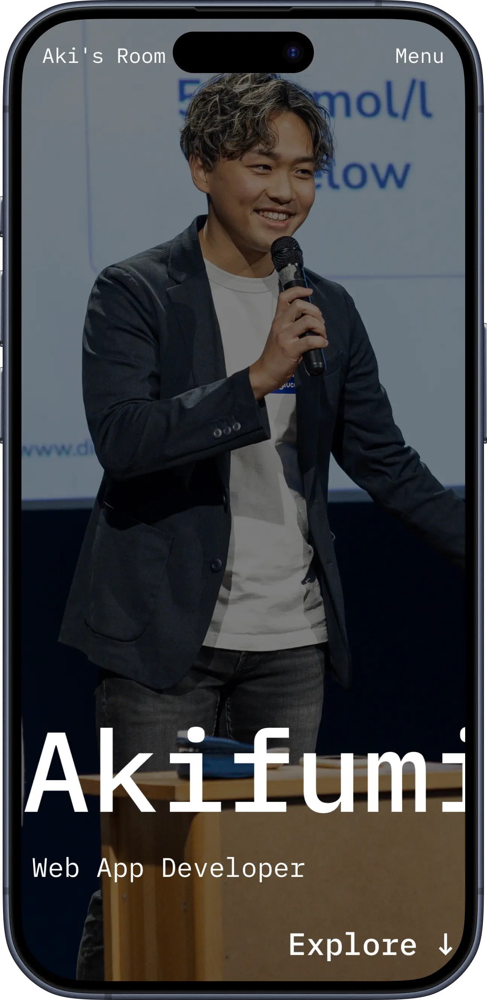
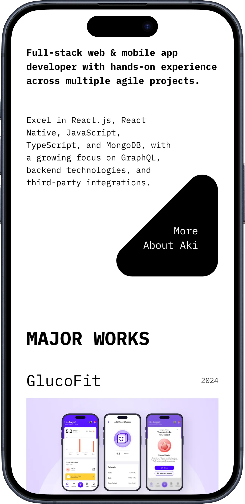
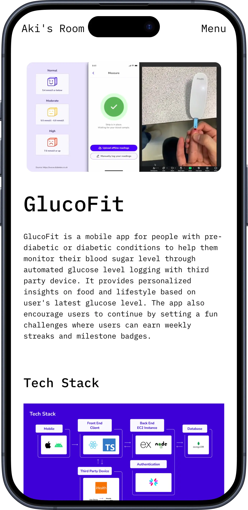
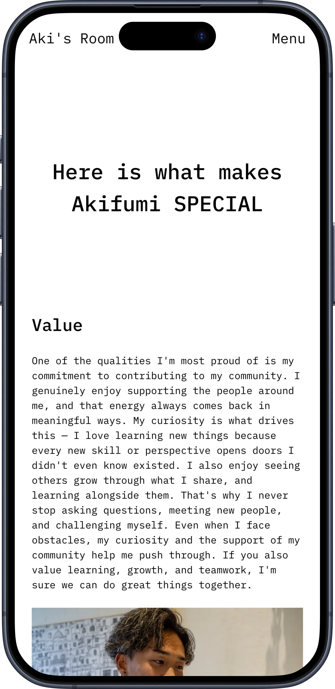
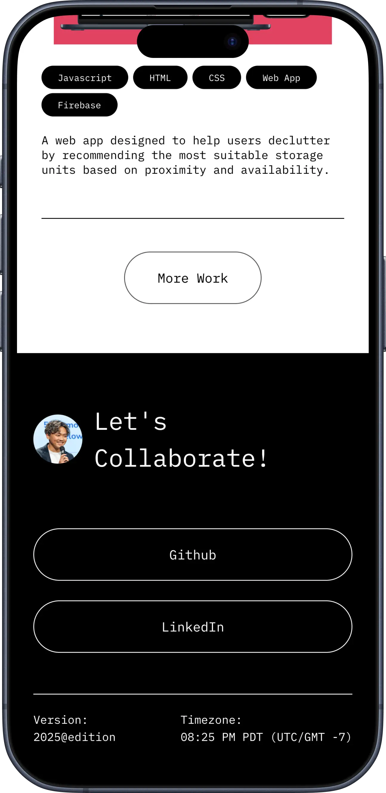
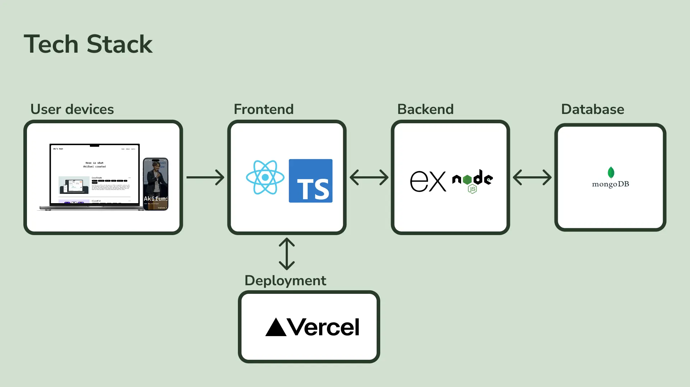

# Aki's Room

  
<strong>My own portfolio website</strong>

A personal portfolio website designed to showcase coding skills and projects, with an intuitive and easy-to-navigate user experience for potential collaborators.

### Live website
  
<a target="_blank" href=https://www.akisroom.com/>Aki's Room

### Screenshots
<table>
  <thead>
    <th>Home screen</th>
    <th>Home screen 2</th>
    <th>Individual</th>
    <th>About</th>
    <th>footer</th>
  </thead>
  <tr>
    <td valign="top"></td>
    <td valign="top"></td>
    <td valign="top"></td>
    <td valign="top"></td>
    <td valign="top"></td>
  </tr>
</table>

## Teck Stack

This website is developed with React on frontend and node.js & Express.js on backend.

  

## Authors
<table>
  <thead>
    <th></th>
    <th>Developer</th>
    <th>Git account</th>
    <th>Role</th>
  </thead>
    <tr>
      <td></td>
      <td>Akifumi Hayashi</td>
      <td><a target="_blank" href=https://github.com/Akiodesukedo>@Akiodesukedo</td>
      <td>Full-stack developer Start from design and coded all the contents, then deployed the website online.</td>
    </tr>
</table>

